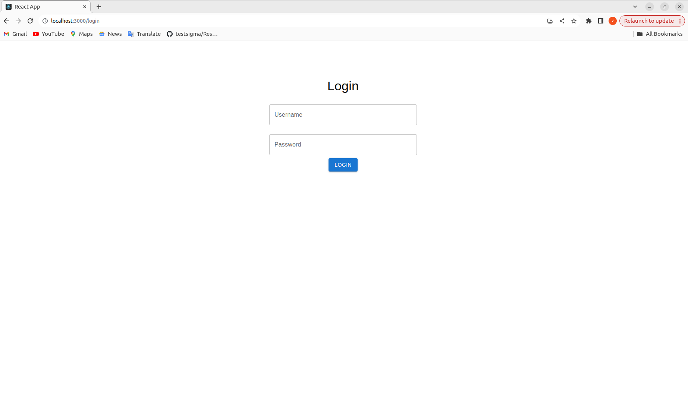
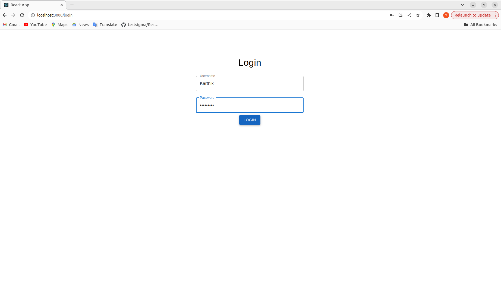
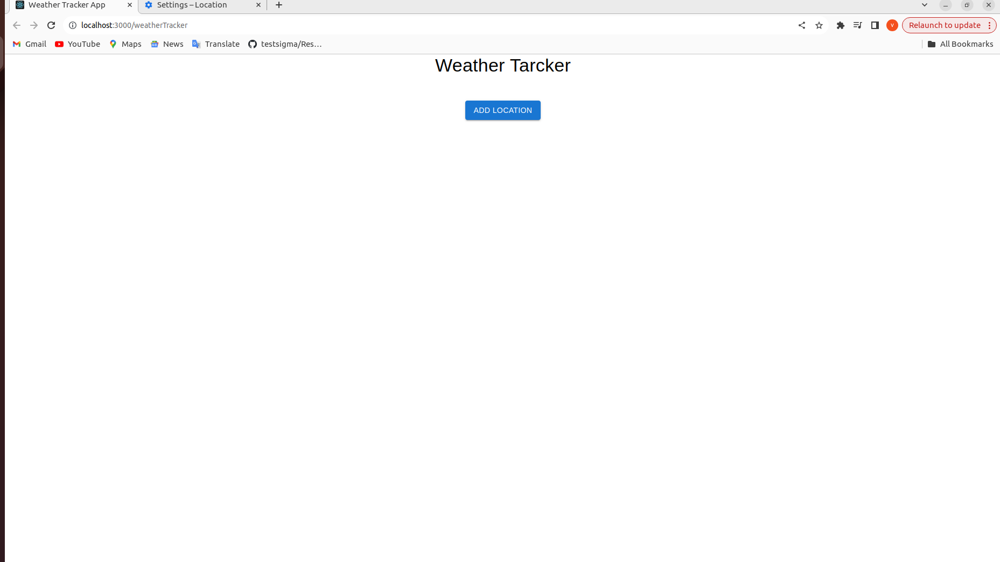
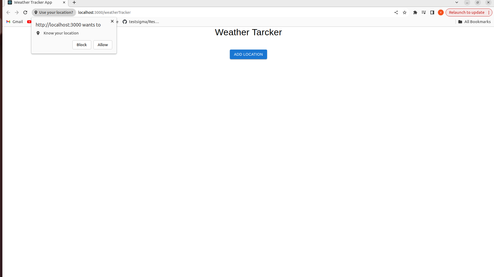
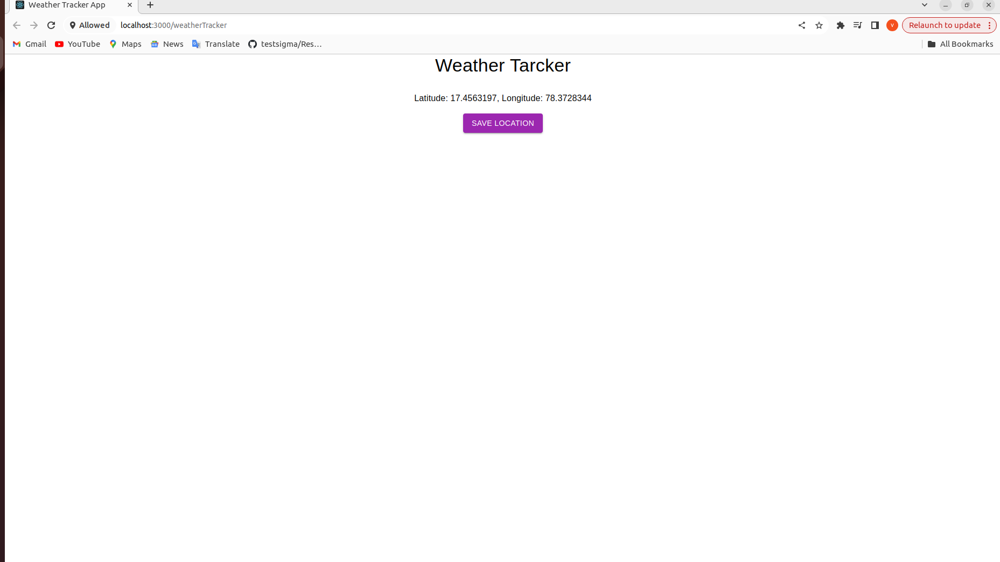
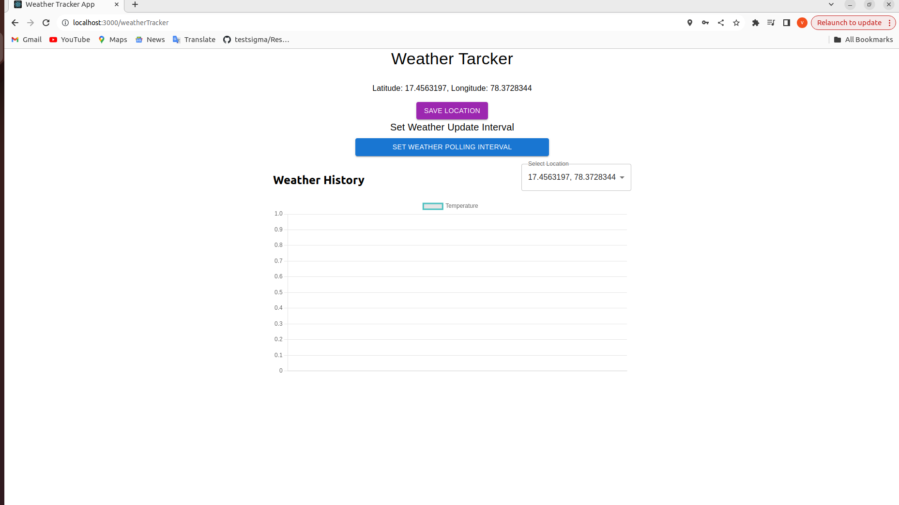
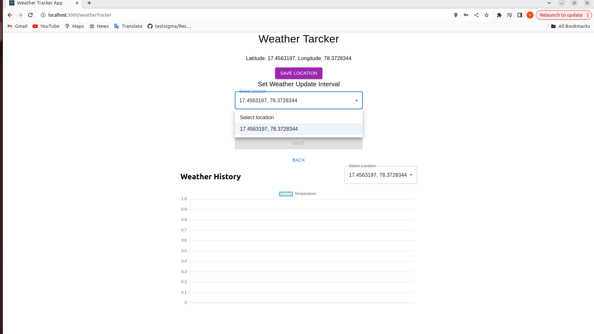
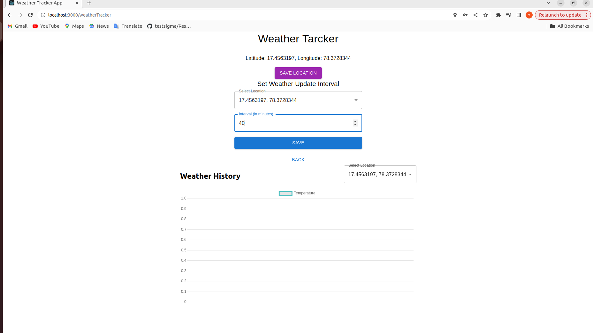
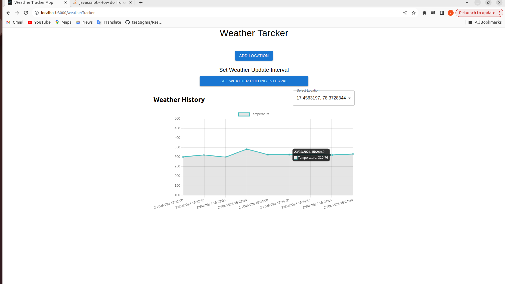

Steps for local run

1. clone the repo
2. Install node and npm 
3. Run the command - "npm i" in project folder
4. Run the command - "npm start" in project folder
5. Naviagete to http://localhost:3000/login  to see the application

